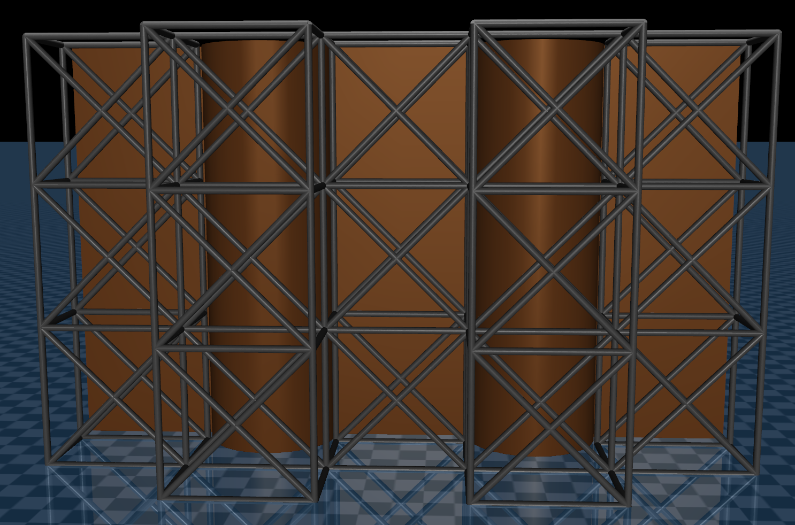

# ISDN-5240 group project
This repository contains the code for our ISDN-5240 group project.

<div float="center">
    
</div>


# Generate scaffold plan

<div float="center">
    
</div>

```
python gen_scaffold_plan.py
```

# Generate point cloud

<div float="center">
    
</div>

```
python gen_point_cloud.py
```
